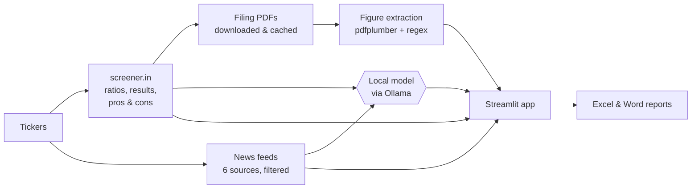

# Indian Stock Data Hub

**A free, open-source research desk for Indian listed companies.** Type in a few ticker symbols and get each company's key ratios, quarterly trends, latest filings, recent news and a plain-English analysis, then export everything to formatted Excel and Word reports.

The optional AI runs **entirely on your own computer** through [Ollama](https://ollama.com). No API keys, no accounts, nothing sent to an AI company.


-1F7A4D)


> **New here?** The illustrated [**User guide (PDF)**](static/user_guide.pdf) walks you through installation, setup and every screen, step by step, with no coding knowledge needed. It's also linked from the app's sidebar.

---

## Features

- **Company snapshot:** market cap, price, P/E, ROE, ROCE and more, plus screener.in's strengths and risks.
- **Quarterly trends:** 13 quarters of results with quarter-on-quarter changes, sparklines and a sales-versus-profit chart.
- **Filings, downloaded for you:** the latest concall transcripts, investor presentations, annual reports and quarterly results (size-capped and cached on disk).
- **Every figure from the PDFs:** thousands of numbers extracted with their page and source sentence, in a searchable table.
- **Recent news:** headlines from Google News, Bing News, Economic Times, Livemint, Business Standard and Hindu BusinessLine, filtered to the company, with spam removed and duplicates merged.
- **Local AI (optional):** a verdict (Positive / Neutral / Cautious), a 3-sentence analysis, a news digest with sentiment, and plain-English error explanations. Pick any model you have installed.
- **Reports:** an Excel workbook (overview dashboard with live formulas, one sheet per company with a chart, all figures in a filterable table) and an A4 Word report with clickable links.
- **Token-frugal:** the model sees only clean, structured data, replies are length-capped, and answers are cached, so re-running costs nothing. Each run shows exactly how many tokens it used.

<table>
  <tr>
    <td></td>
    <td></td>
  </tr>
  <tr>
    <td align="center"><sub>Company card: AI analysis, ratios, strengths and risks, news digest</sub></td>
    <td align="center"><sub>Financials: latest quarter, trends and 13-quarter chart</sub></td>
  </tr>
</table>

## Quick start

You need **Python 3.10 or newer** ([download](https://www.python.org/downloads/); on Windows, tick *"Add python.exe to PATH"* in the installer).

```bash
# 1. Get the code
git clone https://github.com/tapariapurv/indian-stock-data-hub.git
cd indian-stock-data-hub

# 2. Create and activate a virtual environment
python3 -m venv .venv
source .venv/bin/activate          # Windows: .venv\Scripts\activate

# 3. Install dependencies
python -m pip install -r requirements.txt

# 4. Run
python -m streamlit run app.py
```

The app opens at **http://localhost:8501**. Type some tickers (e.g. `RELIANCE, TCS, INFY`) and click **Run analysis**.

No git? Click **Code → Download ZIP** on GitHub, unzip it, and run steps 2 to 4 inside the folder.

## Turn on the local AI (optional)

Everything except the AI verdicts, analyses and news digests works without this.

1. Install **Ollama** from [ollama.com/download](https://ollama.com/download) (Linux: `curl -fsSL https://ollama.com/install.sh | sh`) and make sure it's running.
2. Download a model that suits your computer:

   | Your RAM | Command | Notes |
   |---|---|---|
   | 16 GB+ | `ollama pull gemma4:e2b` | **Recommended.** 7.2 GB; accurate and fast (~2 s per summary) |
   | 24 GB+ | `ollama pull gemma4:e4b` | Larger; preferred automatically when installed |
   | 8 GB | `ollama pull qwen2.5:0.5b` | 0.4 GB and very fast, but less reliable, so treat its verdicts with caution |

   Any other chat model from the [Ollama library](https://ollama.com/library) works too.
3. Refresh the app. The sidebar shows **Ollama connected**, and the **Local model** dropdown lists every model it found on your machine.

## How it works



- **Scraping:** company pages from [screener.in](https://www.screener.in); filings from the links listed there (BSE, NSE and company sites); news from public RSS feeds. Requests are paced, and PDFs are cached in `downloads/` so each is fetched only once.
- **Extraction:** pure code, no AI. Every number in each PDF is captured with its page and surrounding text, then labelled and categorised by keyword rules.
- **AI:** one call per company for the verdict and analysis (≈400 tokens), one for the news digest (≈300 tokens), and one only if a ticker fails (≈100 tokens). The model gets structured data and headlines, never the noisy PDF numbers or full articles.

## Configuration

| Setting | How | Default |
|---|---|---|
| Ollama address | `OLLAMA_HOST` environment variable (same one Ollama uses), e.g. `OLLAMA_HOST=192.168.1.20:11434` | `http://localhost:11434` |
| App port | `python -m streamlit run app.py --server.port 8502` | `8501` |
| Max filing size | `MAX_FILE_MB` in `app.py` | 25 MB |
| Result cache | `CACHE_TTL_SECONDS` in `app.py` | 1 hour |
| News window / count | `NEWS_MAX_AGE_DAYS`, `NEWS_MAX_ITEMS` in `app.py` | 14 days / 8 |
| Model ranking | `OLLAMA_MODEL_PREFERENCE` in `app.py` | best first |
| Look and feel | `.streamlit/config.toml` | light "research desk" theme |

## Project structure

```
├── app.py                  # the whole app: scraping, extraction, AI, UI, exports
├── requirements.txt
├── .streamlit/config.toml  # theme + static file serving (for the guide link)
├── static/user_guide.pdf   # user guide, opened from the app's sidebar
├── docs/
│   ├── user_guide.html     # source of the PDF guide (rebuild steps inside)
│   └── images/             # screenshots
└── tests/
    ├── test_exports.py     # Excel/Word files are valid and injection-safe
    └── test_app_smoke.py   # app starts and every tab renders
```

## Running the tests

No test framework needed, and no network or Ollama either:

```bash
python tests/test_exports.py
python tests/test_app_smoke.py
```

`test_exports.py` builds both reports from sample data containing hostile text, and checks that no scraped text becomes an Excel formula, that Word's XML is in the order Word requires, and that both files re-open. `test_app_smoke.py` runs the real app headlessly and renders all three result tabs.

## Troubleshooting

| Problem | Fix |
|---|---|
| `python` / `python3` not found | Install Python 3.10+; on Windows re-run the installer with *Add python.exe to PATH* ticked. |
| Windows: "running scripts is disabled" | Skip activation and prefix commands with `.venv\Scripts\`, e.g. `.venv\Scripts\python -m streamlit run app.py`. |
| "No module named streamlit" | Activate the virtual environment first (`source .venv/bin/activate` or `.venv\Scripts\activate`). |
| A ticker shows **Failed** | Check the symbol: it's the part after `/company/` in the company's screener.in URL. |
| Sidebar says **Ollama not detected** | Start Ollama, check http://localhost:11434 says "Ollama is running", then refresh. |
| "… returned no summary" | Update Ollama (0.9+ required) or choose another model. |
| Stale numbers | Results are cached for an hour: use **⋮ → Clear cache** in the app. |

More answers are in chapter 11 of the [user guide](static/user_guide.pdf).

## Disclaimer

This project is for **personal research and education**. It is **not investment advice**: AI verdicts come from a small language model reading scraped data and can be wrong. Always verify against the original filings.

The app reads publicly available web pages. Please use it responsibly: analyse a handful of companies at a time, and respect the terms of use of screener.in and the other sites it reads. This project is not affiliated with screener.in, any exchange, or any news publisher.

## Contributing

Issues and pull requests are welcome. Before opening a PR, run both test scripts above. The app deliberately lives in one file (`app.py`) so it's easy to read top to bottom.

## License

[MIT](LICENSE) © 2026 Purv Taparia
