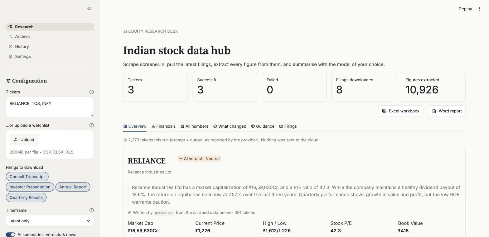
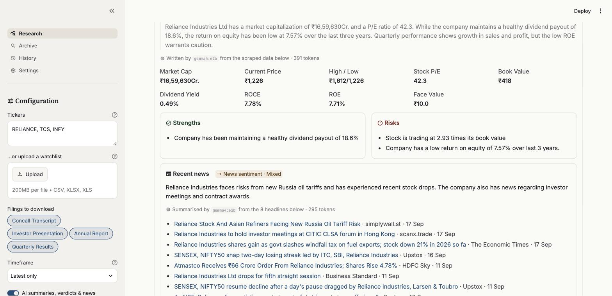
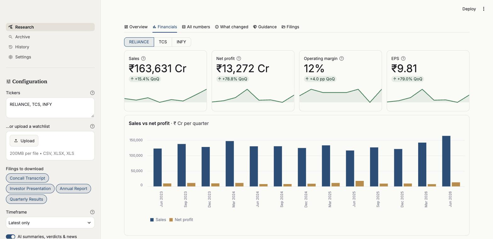
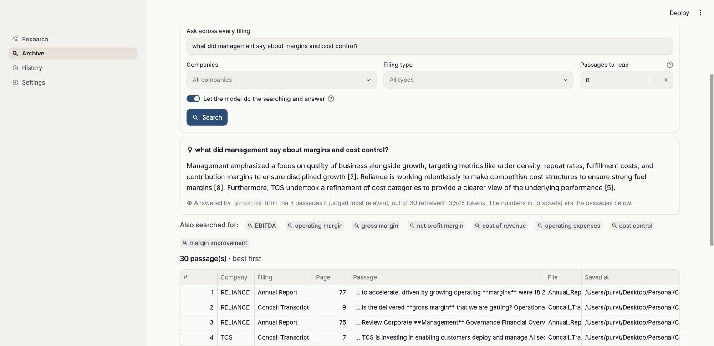
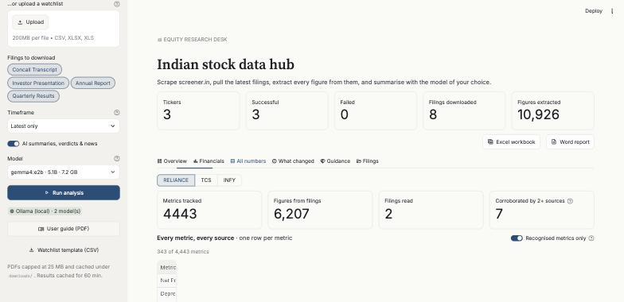
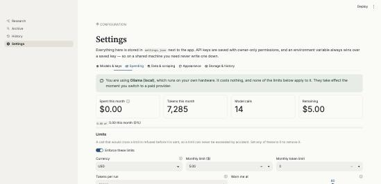
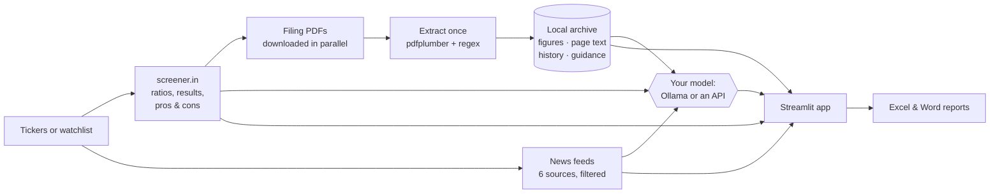

# Indian Stock Data Hub

**A free, open-source research desk for Indian listed companies.** Type in a few ticker symbols — or upload a watchlist — and get each company's key ratios, quarterly trends, latest filings, recent news and a plain-English analysis, then export everything to formatted Excel and Word reports.

Everything it downloads stays on your machine: filings are parsed once, searchable across companies forever, and every analysis is saved so you can see what changed since last time. The AI is optional and runs **locally by default** through [Ollama](https://ollama.com) — or against Anthropic, OpenAI, Google, OpenRouter or your own server if you prefer.




> **New here?** The illustrated [**User guide (PDF)**](static/user_guide.pdf) walks you through installation, setup and every screen, step by step, with no coding knowledge needed. It's also linked from the app's sidebar.

---

## What you won't find elsewhere

Plenty of sites show you a company's numbers. These three things come from the app keeping its own archive:

- **Promise vs delivery.** Every quarter management commits to something on the earnings call — margins, growth, capex. The app pulls those commitments out of the transcript, files them, and grades them against the numbers actually reported later. Over eight quarters you get something no screener will tell you: how often this management does what it says.
- **Ask your own filings, in plain English.** Every transcript, presentation and annual report you download is indexed, and the search actually reasons: the model first suggests the vocabulary a filing would really use (ask about "capex" and it adds *capital expenditure*, *expansion plans*, *growth strategy*), the database retrieves, the model discards the coincidental matches, then answers from what's left with citations. Asked about capex on a real Reliance archive it came back with ₹39,000 crore, cited from both the transcript and the annual report — in six seconds, offline.
- **What changed since last time.** Each analysis is saved. Run a company again and the app lists what moved: ratios, strengths and risks, new filings, new headlines, a changed verdict. Plain comparison, no model, so nothing is invented.

## Features

- **Company snapshot:** market cap, price, P/E, ROE, ROCE and more, plus screener.in's strengths and risks.
- **Quarterly trends:** 13 quarters of results with quarter-on-quarter changes, sparklines and a sales-versus-profit chart, plus the profit &amp; loss, balance sheet, cash flow and shareholding tables.
- **Filings, downloaded for you:** the latest concall transcripts, investor presentations, annual reports and quarterly results (size-capped, cached on disk, parsed once ever).
- **Every figure from the PDFs:** thousands of numbers extracted with their page and source sentence, in a searchable table.
- **All numbers, correlated:** one row per metric showing the published ratio, the last two quarters, and what every filing says about it — count, latest, and the low/median/high spread, so an odd number stands out instead of hiding.
- **Recent news:** headlines from Google News, Bing News, Economic Times, Livemint, Business Standard and Hindu BusinessLine, filtered to the company, spam removed and duplicates merged.
- **Your choice of model:** Ollama locally, or Anthropic, OpenAI, Google, OpenRouter and any OpenAI-compatible server. Keys live in your settings file or in environment variables.
- **Batch analysis:** upload a CSV or Excel watchlist and analyse the whole list in one run.
- **Saved history:** reopen any past analysis, chart a ratio across months, and control exactly how long anything is kept. Every saved run lists the filings behind it — the file on disk, the pages its figures came from, and a link to the original — and each metric carries the exact pages it appeared on.
- **Reports:** an Excel workbook (overview dashboard with live formulas, a sheet per company with a chart, an **All numbers** sheet and every figure in a filterable table) and an A4 Word report with clickable links.
- **Token-frugal:** the model sees only clean, structured data, replies are length-capped, and answers are cached — re-running costs nothing, and every run reports exactly how many tokens it used.

<table>
  <tr>
    <td></td>
    <td></td>
  </tr>
  <tr>
    <td align="center"><sub>Company card: AI analysis, ratios, strengths and risks, news digest</sub></td>
    <td align="center"><sub>Financials: latest quarter, trends and 13-quarter chart</sub></td>
  </tr>
  <tr>
    <td></td>
    <td></td>
  </tr>
  <tr>
    <td align="center"><sub>Archive: the model expands the question, ranks what it finds and answers with citations</sub></td>
    <td align="center"><sub>All numbers: every metric against every source that reports it</sub></td>
  </tr>
  <tr>
    <td colspan="2"></td>
  </tr>
  <tr>
    <td colspan="2" align="center"><sub>Spending: real limits on a paid provider, and what has actually been used</sub></td>
  </tr>
</table>

## Quick start

You need **Python 3.10 or newer** ([download](https://www.python.org/downloads/); on Windows, tick *"Add python.exe to PATH"* in the installer).

```bash
# 1. Get the code
git clone https://github.com/tapariapurv/indian-stock-data-hub.git
cd indian-stock-data-hub

# 2. Create and activate a virtual environment
python3 -m venv .venv
source .venv/bin/activate          # Windows: .venv\Scripts\activate

# 3. Install dependencies
python -m pip install -r requirements.txt

# 4. Run
python -m streamlit run app.py
```

The app opens at **http://localhost:8501**. Type some tickers (e.g. `RELIANCE, TCS, INFY`) and click **Run analysis**.

No git? Click **Code → Download ZIP** on GitHub, unzip it, and run steps 2 to 4 inside the folder.

## Choosing a model (optional)

Everything except the verdicts, analyses, news digests, transcript reading and archive answers works without a model. There are four ways to set one up, and you can switch at any time in **Settings → Models & keys**.

| Route | Good when | Cost | Your data |
|---|---|---|---|
| **Ollama** | The simplest local setup. The default. | Free | Stays on your machine |
| **A local app** | You already run LM Studio, Jan or llama.cpp | Free | Stays on your machine |
| **A hosted API** | You want the strongest models | Per token | Sent to that provider |
| **Your own server** | A GPU box, work server or rented instance | Yours | Stays on that server |

**Ollama.** Install from [ollama.com/download](https://ollama.com/download) (Linux: `curl -fsSL https://ollama.com/install.sh | sh`), check `http://localhost:11434` says *Ollama is running*, then `ollama pull <name>` with any chat model from the [library](https://ollama.com/library). Size is what matters: roughly 1–2 GB on 8 GB of RAM, 4–8 GB on 16 GB, larger above that. Small models are fast but misread financial context — one we tested called a 7.6% ROE a "strong position" — so treat their verdicts with caution.

**A local app or your own server.** Turn on its OpenAI-compatible endpoint, then pick *Custom / self-hosted* and paste the address (e.g. `http://localhost:1234/v1`). For Ollama on another machine, keep the Ollama provider and change the address.

**A hosted API.** Pick the provider, paste a key, hit *Test connection*:

| Provider | Key from | Environment variable |
|---|---|---|
| Anthropic | console.anthropic.com | `ANTHROPIC_API_KEY` |
| OpenAI | platform.openai.com | `OPENAI_API_KEY` |
| Google (Gemini) | aistudio.google.com | `GOOGLE_API_KEY` |
| OpenRouter | openrouter.ai | `OPENROUTER_API_KEY` |
| Custom / self-hosted | your own server | `CUSTOM_API_KEY` |

An environment variable always wins over a key saved in `settings.json`, so you never have to write one to disk. `settings.json` is gitignored and written with owner-only permissions.

## Keeping a paid model on a leash

**Settings → Spending** enforces three limits, and a call that would cross one is refused *before it is sent*:

| Limit | Default | What it's for |
|---|---|---|
| Tokens per run | 50,000 | The one that saves you — a 50-company watchlist can spend a month's budget in one click |
| Monthly cost | 5.00 | A ceiling in your currency, counted from the 1st |
| Monthly tokens | off | The same idea for free tiers with an allowance |

Every call is written to a local ledger, so the spend shown is what actually happened, broken down by provider, model and what it was spent on. Enter your provider's price per million tokens (input and output) next to its key — the app ships no price list, because a stale one is worse than none. Local models are free, recorded as free, and never blocked.

For scale: a company review is ≈400 tokens, a news digest ≈300, an archive question ≈2,800 including the search steps. Answers are cached, so re-running a company costs nothing.

## Analysing a watchlist

Upload a CSV or Excel file with a `ticker` column (`symbol`, `scrip`, `code` and `NSE code` also work; otherwise the first column is used). The sidebar has a **Watchlist template (CSV)** button that gives you the right shape:

```csv
ticker,notes
RELIANCE,core holding
TCS,
INFY,watching
```

## How it works



- **Scraping:** company pages from [screener.in](https://www.screener.in); filings from the links listed there (BSE, NSE and company sites); news from public RSS feeds. Requests are pooled and paced, filings download in parallel, and PDFs are cached in `downloads/`.
- **Extraction:** pure code, no AI. Every number in each PDF is captured with its page and surrounding text, then labelled and categorised by keyword rules. Results are keyed by file hash in the archive, so a filing is parsed **once, ever** — however many times you re-analyse it.
- **AI:** one call per company for the verdict and analysis (≈400 tokens), one for the news digest (≈300), one only if a ticker fails (≈100). Reading a transcript or answering an archive question happens only when you ask for it; an archive question costs three calls (expand, re-rank, answer) and around 2,800 tokens. The model gets structured data, headlines and retrieved passages — never the noisy raw PDF numbers.

## The four pages

| Page | What it's for |
|---|---|
| **Research** | Run an analysis; read it across Overview, Financials, All numbers, What changed, Guidance and Filings. |
| **Archive** | Ask a question across every filing you've downloaded: the model expands the wording, ranks what's found and answers with citations — offline. |
| **History** | Reopen any saved analysis and chart a ratio over months. |
| **Settings** | Models and keys, scraping limits, appearance, and what gets kept for how long. |

## Configuration

Almost everything is set from **Settings** inside the app and stored in `settings.json`:

| Area | Examples |
|---|---|
| Models & keys | Provider, server address, API key, model, reply-length caps, temperature, timeout |
| Data & scraping | Default tickers and filing types, size and page limits, parallel downloads, politeness delay, news window, feature switches |
| Appearance | Accent colour, text size, spacing, chart colours, table height, decimals, sparklines, which tabs appear and in what order |
| Storage & history | How long to keep saved analyses, filing PDFs and searchable text; per-company caps; automatic clear-out |

A few things are still set at launch:

| Setting | How | Default |
|---|---|---|
| Ollama address | `OLLAMA_HOST` environment variable (or type it into Settings) | `http://localhost:11434` |
| App port | `python -m streamlit run app.py --server.port 8502` | `8501` |
| Base theme | `.streamlit/config.toml` | light "research desk" theme |

If the appearance settings ever look wrong, switch off **Apply my appearance settings** and the app falls straight back to that base theme.

## What's kept, and for how long

| Data | Default | Where |
|---|---|---|
| Saved analyses | 180 days, max 40 per company | `downloads/archive.db` |
| Filing PDFs | 90 days | `downloads/<TICKER>/` |
| Searchable filing text | 365 days | `downloads/archive.db` |

Set any limit to 0 to keep it forever. The clear-out runs at startup, on demand, or not at all — your choice. Nothing is ever uploaded.

## Project structure

```
├── app.py                  # entry point: theme + page navigation
├── core.py                 # scraping, downloads, PDF extraction, news, correlation
├── llm.py                  # every model provider behind one interface
├── archive.py              # local SQLite: extraction cache, search, history, guidance
├── exports.py              # Excel and Word report builders
├── settings.py             # defaults, settings file, appearance
├── ui.py                   # shared rendering (company card, tables)
├── app_pages/
│   ├── research.py         # run an analysis and read it
│   ├── archive_search.py   # search every downloaded filing
│   ├── history.py          # past analyses
│   └── settings_page.py    # all settings
├── requirements.txt
├── .streamlit/config.toml  # base theme + static file serving (for the guide link)
├── static/user_guide.pdf   # 23-page user guide, opened from the sidebar
├── docs/
│   ├── user_guide.html     # source of the PDF guide (rebuild steps inside)
│   └── images/             # screenshots
└── tests/
    ├── test_exports.py     # Excel/Word files are valid and injection-safe
    ├── test_archive.py     # cache, search, history, retention, watchlists
    ├── test_providers.py   # every provider, spend tracking and budget limits
    └── test_app_smoke.py   # every page and tab renders
```

## Running the tests

No test framework needed, and no network, model or API key either:

```bash
python tests/test_exports.py
python tests/test_archive.py
python tests/test_providers.py
python tests/test_app_smoke.py
```

`test_exports.py` builds both reports from sample data containing hostile text, and checks that no scraped text becomes an Excel formula, that Word's XML is in the order Word requires, and that both files re-open. `test_archive.py` runs the archive against a throwaway database: extraction caching, full-text search, saved history and diffs, guidance, retention limits and watchlist parsing. `test_providers.py` runs all six providers against a mock server that speaks the real API shapes, checking the requests, the authentication headers, the token accounting and that a spending limit actually refuses a call. `test_app_smoke.py` runs the real app headlessly and renders every page and tab.

## Troubleshooting

| Problem | Fix |
|---|---|
| `python` / `python3` not found | Install Python 3.10+; on Windows re-run the installer with *Add python.exe to PATH* ticked. |
| Windows: "running scripts is disabled" | Skip activation and prefix commands with `.venv\Scripts\`, e.g. `.venv\Scripts\python -m streamlit run app.py`. |
| "No module named streamlit" | Activate the virtual environment first (`source .venv/bin/activate` or `.venv\Scripts\activate`). |
| A ticker shows **Failed** | Check the symbol: it's the part after `/company/` in the company's screener.in URL. |
| Sidebar badge says the provider isn't reachable | Open **Settings → Models & keys** and hit *Test connection*. For Ollama, check http://localhost:11434 says "Ollama is running". |
| The model returns no summary | Update Ollama (0.9+ required) or pick another model. Raise the reply cap in **Settings → Generation limits** if answers look cut off. |
| Stale numbers | Results are cached for an hour: **Settings → Clear cached results**. |
| Guidance tab says no transcript | Tick **Concall Transcript** in the sidebar and run the analysis again. |

More answers are in chapter 16 of the [user guide](static/user_guide.pdf).

## Disclaimer

This project is for **personal research and education**. It is **not investment advice**: AI verdicts come from a language model reading scraped data and can be wrong, and the guidance grades are a prompt to go and read the transcript yourself, not a verdict. Always verify against the original filings.

The app reads publicly available web pages. Please use it responsibly: analyse a sensible number of companies at a time, leave the politeness delay in place, and respect the terms of use of screener.in and the other sites it reads. This project is not affiliated with screener.in, any exchange, or any news publisher.

## Contributing

Issues and pull requests are welcome. Before opening a PR, run the four test scripts above.

## License

[MIT](LICENSE) © 2026 Purv Taparia
